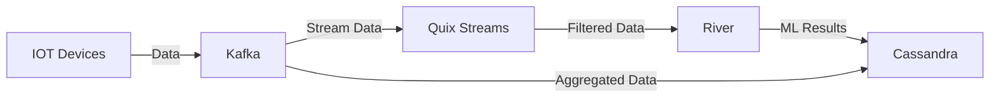

# Design and implementation of a textual domain language to produce machine learning applications on data streams

## Description

One of the technological areas that has experienced an explosion in recent years is that of machine learning. Now, given the information age we live in, it is unthinkable to produce/record data without being accompanied by a machine learning algorithm and/or data processing for their denoising or automatic inference. Due to the huge market need for machine learning algorithms, there is a large number of low/no-code platforms, free to use or under commercial license, which offer graphical design capabilities of an ML solution, the use of which is quite simple even for citizen developers. However, the vast majority of these platforms offer their services for static datasets, which must be imported into the corresponding package in order to perform the analyses. In this thesis, DSLs oriented towards machine learning and data processing algorithms will be implemented, which will be applied (mainly) to live data, offering their results also as streams. The goal is to create tools that can process data generated by cyber-physical systems, and visualize them in Dashboards, through transformations in other DSLs.

## Tools that are being used

- Apache Kafka
- Quix streams
- River
- Docker
- Cassandra

A visual representation of the process that will be built is displayed below

Below i will explain each tool and its usage for the project
