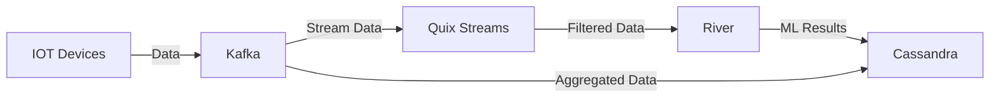

# Design and implementation of a textual domain language to produce machine learning applications on data streams

## Description

One of the technological areas that has experienced an explosion in recent years is that of machine learning. Now, given the information age we live in, it is unthinkable to produce/record data without being accompanied by a machine learning algorithm and/or data processing for their denoising or automatic inference. Due to the huge market need for machine learning algorithms, there is a large number of low/no-code platforms, free to use or under commercial license, which offer graphical design capabilities of an ML solution, the use of which is quite simple even for citizen developers. However, the vast majority of these platforms offer their services for static datasets, which must be imported into the corresponding package in order to perform the analyses. In this thesis, DSLs oriented towards machine learning and data processing algorithms will be implemented, which will be applied (mainly) to live data, offering their results also as streams. The goal is to create tools that can process data generated by cyber-physical systems, and visualize them in Dashboards, through transformations in other DSLs.

## Tools that are being used

- Apache Kafka
- Quix streams
- River
- Docker
- Cassandra
- Text-X

A visual representation of the process that will be built is displayed below

Below i will explain each tool and its usage for the project

## JSL (Jason Specific Language)

The JSL (Jason Specific Language) is a domain-specific language designed to define and configure data processing pipelines. The language allows users to specify various components of a pipeline, including Kafka configurations, machine learning models, features, metrics, targets, and plotting options.

### Grammar Overview

The `jsl.tx` file defines the grammar for the JSL language. Below is an overview of the main components:

- **Pipeline**: The top-level construct that defines a data processing pipeline.
- **Kafka**: Configuration for Kafka, including broker address, input and output topics, and consumer group.
- **Model**: Definition of the machine learning model, including preprocessing, model type, name, and parameters.
- **Feature**: Specification of the features used in the model.
- **Metric**: Definition of the evaluation metrics.
- **Target**: Specification of the target variable and optional mappings.
- **Plot**: Configuration for plotting the results.

## Kafka

### Purpose

The kafka folder contains scripts and configurations for setting up and managing a Kafka environment. This includes producing and consuming messages, as well as administrative tasks such as creating and deleting topics. The folder also includes a Docker Compose file for setting up a Kafka cluster using Docker.

### Files

#### admin_kafka.py

Contains functions for Kafka administrative tasks using the confluent_kafka library.
Functions include creating and deleting topics.
Example usage of AdminClient to manage Kafka topics.
consumer2.py

Script for consuming messages from a Kafka topic.
Uses the confluent_kafka library to create a Kafka consumer.
Includes logic for handling messages and closing the consumer gracefully.

#### docker-compose.yml

Docker Compose configuration file for setting up a Kafka cluster.
Defines services for Kafka controllers and brokers.
Includes environment variables and dependencies for each service.
Also includes a Kafka UI service for managing the Kafka cluster.

#### kafka_server_funcs.py

Contains utility functions for parsing command-line arguments.
Used by other scripts to standardize argument parsing.

#### producer_v2.py

Script for producing messages to a Kafka topic.
Uses the confluent_kafka library to create a Kafka producer.
Includes functions for constructing events and IDs, initializing namespaces, and handling delivery callbacks.
Parses command-line arguments to configure the producer.

## Quix Streams

This directory contains various scripts and modules for processing and analyzing streaming data using Kafka and Quix Streams.

#### **init**.py

An empty file that indicates that the directory should be treated as a Python package.

#### kafka_test.py

A script for testing Kafka integration with Quix Streams. It reads data from a Kafka topic, processes it, and writes the results to different Kafka topics. The script includes examples of filtering, dropping columns, and producing alerts.

#### windowing.py

A script that demonstrates windowing operations on streaming data using Quix Streams. It reads data from a Kafka topic, applies tumbling windows, and computes aggregate functions such as sum and mean. The results are then written to another Kafka topic.

## wikimedia

This directory is a project for processing and analyzing Wikimedia streaming data using Kafka, Quix Streams and River.

#### HoeffdingTreeClassifier.pkl

A serialized file containing the trained `HoeffdingTreeClassifier` model. This model is used for predicting whether a user is a bot or a human based on Wikimedia event data.

#### model.py

A script for training a `HoeffdingTreeClassifier` model using streaming data from a Kafka topic. The script reads data from the `wikipedia-events` Kafka topic, processes it, trains the model, and writes the results to the `filtered-wikipedia-events` Kafka topic.

#### prediction.py

A script for loading the trained `HoeffdingTreeClassifier` model and using it to make predictions on new data. The script includes an example of predicting whether a user is a bot or a human based on a sample Wikimedia event.

#### producer.py

A script for producing Wikimedia event data to a Kafka topic. The script consumes data from the Wikimedia EventStreams API, processes it, and produces messages to the `wikipedia-events` Kafka topic.
