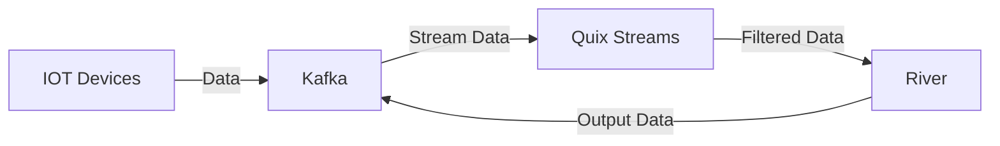

# :penguin: Penguin

<p align="center">
  
</p>

## Table of Contents

- [Description](#memo-description)
- [Prerequisites](#prerequisites)
- [Installation](#installation)
- [Quickstart](#ocean-quickstart)
- [Detailed Explanation](#detailed-explanation)
  - [Pipeline](#pipeline)
  - [Kafka](#kafka)
  - [Model](#model)
  - [Features](#features)
  - [Metrics](#metrics)
  - [Target](#target)
  - [Plot](#plot)
- [Usage](#usage)
- [Tools and Technologies](#tools-and-technologies)
- [Visual Representation](#visual-representation)
- [Contributing](#contributing)
- [License](#license)

## :memo: Description

Penguin is a DSL language designed for machine learning in live data. It is designed to make the process of retrieving, storing, filtering data as well as training models easy and accessible to everybody.

## Prerequisites

- Python 3.x
- Docker
- Apache Kafka
- Other dependencies as required

## :wrench: Installation

1. Clone the repository:

   ```bash
   git clone https://github.com/deepblue597/thesis.git
   cd thesis
   ```

2. Install the required Python packages:

   ```bash
   pip install -r requirements.txt
   ```

3. Set up Kafka infrastructure:
   ```bash
   cd kafka_proj
   docker compose up
   ```

## :ocean: Quickstart

To create your first pipeline we will start with a classification example which can be found in `classification.peng`

```plaintext
pipeline MyPipeline {
    kafka {
        broker: "localhost:39092"
        input_topic: "wikipedia-events"
        output_topic: "filtered-wikipedia-events"
        consumer_group: "wikipedia-model"
    }
    model {
        preprocessing : {

            preprocesor {
                name : OneHotEncoder
                feature_type : str
            }

            preprocesor {
                name : StandardScaler
                feature_type : int
            }
        }
        type : linear_model
        name: LogisticRegression

        optimizer {

        name : Adam

        }
    }

    features {

        raw_featues : {
            domain
            namespace
            title
            comment
            user_name
            new_length
            old_length
            minor
        }

        generated_features: {


            len_diff = new_length - old_length;
        }

    }


    metrics : {
        MAE
        MSE
    }

    target : {
        name: "user_type"
        mapping {
            bot: 1
            human: 0
        }
    }

    plot: {
        type: heatmap
    }
}
```

To run this code, save it as `<name>.peng`, go to the penguin folder by typing:

```bash
cd penguin
```

and then type in your terminal:

```bash
python3 generator.py --metamodel <name>.peng --generated_file_name <pipeline>.py
```

This will create your pipeline at `<pipeline>.py`. Then you can type:

```bash
python3 <pipeline>.py
```

and your model will be created.

## :memo: Detailed Explanation

### Pipeline

A `Pipeline` is the top-level construct that contains all the components of a machine learning pipeline.

```plaintext
pipeline <name> {
    kafka { ... }
    model { ... }
    features { ... }
    metrics { ... }
    target { ... }?
    plot { ... }?
}
```

### Kafka

The `Kafka` component specifies the Kafka configuration for the pipeline.

```plaintext
kafka {
    broker: "<broker>"
    input_topic: "<input_topic>"
    output_topic: "<output_topic>"
    consumer_group: "<consumer_group>"
}
```

### Model

The `Model` component defines the machine learning model used in the pipeline. It can optionally include an ensemble configuration and preprocessing steps.

```plaintext
model {
    ensemble: {
        algorithm: <algorithm>
        number_of_models: <num>
        seed: <seed>
    }?
    preprocessing: {
        preprocessor {
            name: <name>
            feature_for_process: <process_feature>?
            feature_type: <feature_type>?
            params: {
                <param_name> = <param_value>
            }?
        }+
    }?
    type: <type>
    name: <name>
    params: {
        <param_name> = <param_value>
    }?
    optimizer: {
        name: <name>
        params: {
            <param_name> = <param_value>
        }?
    }?
}
```

### Features

The `Feature` component specifies the raw and generated features used in the model.

```plaintext
features {
    raw_features: {
        <feature1> <feature2> ...
    }
    generated_features: {
        <assignment1>
        <assignment2>
        ...
    }?
}
```

### Metrics

The `Metric` component specifies the metrics used to evaluate the model.

```plaintext
metrics: {
    <metric1> <metric2> ...
}
```

### Target

The `Target` component defines the target variable for the model and optionally includes mappings.

```plaintext
target {
    name: "<name>"
    mapping {
        <key>: <value>
    }?
}
```

### Plot

The `Plot` component specifies the plot configuration for visualizing the results.

```plaintext
plot: {
    type: <type>
    x: "<x_axis>"
}
```

## :droplet: River support

A table of the supported functionalities the DSL has for River

| Feature            | Supported? |
| ------------------ | ---------- |
| active             | ⬜         |
| anomaly            | 🚧         |
| bandit             | ⬜         |
| base               | ⬜         |
| cluster            | ⬜         |
| compat             | ⬜         |
| compose            | ⬜         |
| conf               | ⬜         |
| covariance         | ⬜         |
| datasets           | ⬜         |
| drift              | ⬜         |
| dummy              | ⬜         |
| ensemble           | ⬜         |
| evaluate           | ⬜         |
| facto              | ⬜         |
| feature_extraction | ⬜         |
| feature_selection  | ⬜         |
| forest             | ⬜         |
| imblearn           | ⬜         |
| linear_model       | 🚧         |
| metrics            | ⬜         |
| misc               | ⬜         |
| model_selection    | ⬜         |
| multiclass         | ⬜         |
| multioutput        | ⬜         |
| naive_bayes        | ⬜         |
| neighbors          | ⬜         |
| neural_net         | ⬜         |
| optim              | ⬜         |
| preprocessing      | ⬜         |
| proba              | ⬜         |
| reco               | ⬜         |
| rules              | ⬜         |
| sketch             | ⬜         |
| stats              | ⬜         |
| stream             | ⬜         |
| time_series        | ⬜         |
| tree               | ⬜         |
| utils              | ⬜         |

## :computer: Usage

The `examples` folder contains several projects that demonstrate how to use the Penguin DSL for different machine learning tasks. Below is a brief description of each project:

### Wikimedia Project

The Wikimedia project demonstrates how to use the Penguin DSL to create a machine learning pipeline for classifying Wikipedia events. The project includes the following files:

- `HoeffdingTreeClassifier.pkl`: A pre-trained model file.
- `model.py`: Script for defining and training the model.
- `prediction.py`: Script for making predictions using the trained model.
- `producer.py`: Script for producing data to Kafka topics.

### Electricity Project

The Electricity project showcases how to use the Penguin DSL for predicting electricity consumption. The project includes the following files:

- `combined_file_hourly.csv`: Combined hourly electricity consumption data.
- `combined_file.csv`: Combined electricity consumption data.
- `consumer.py`: Script for consuming data from Kafka topics.
- `data_test.py`: Script for testing data processing.
- `FR_2024_hourly.csv`: Hourly electricity consumption data for France.
- `live_producer.py`: Script for live data production.
- `playground.py`: Script for experimenting with data and models.
- `prediction.py`: Script for making predictions using the trained model.
- `producer.py`: Script for producing data to Kafka topics.
- `SNARIMAX_electricity_h.pkl`: A pre-trained model file for electricity consumption prediction.

### House Prices Project

The House Prices project demonstrates how to use the Penguin DSL for predicting house prices. The project includes the following file:

- `house-prices.py`: Script for defining, training, and evaluating the house prices prediction model using the Penguin DSL.

## 🛠 Tools and Technologies

- Apache Kafka
- Quix streams
- River
- Docker
- Text-X

## :eyes: Visual Representation

A visual representation of the process that will be built is displayed below:



## 🤝 Affiliations


