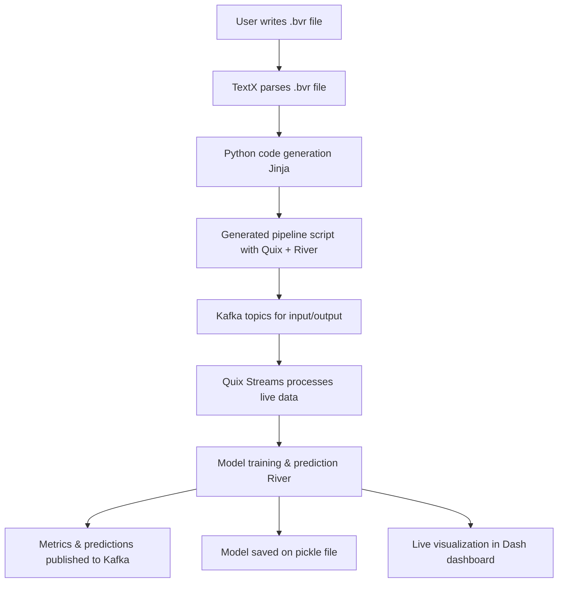

# Beaver 🦫

Beaver is DSL for Machine Learning in live data. It's purpose is to simplify the process of data retrieval and preprocessing, model training, model prediction and output display. It uses multiple tools to achieve this:

- Kafka
- Quixstreams
- River
- Plotly
- Dash
- Docker
- TextX
- Jinja

## ✨ Features

- 🔍 **Static Model Validation**: Validate your `.bvr` files before code generation
- 📊 **Model Analysis**: Get insights and suggestions for improving your models
- 🛠️ **Enhanced CLI**: Unified command-line interface for all operations
- ✅ **Syntax Checking**: Validate generated Python code syntax and compilation
- 📈 **Comprehensive Algorithm Support**: Full support for all River algorithm types
- 🔧 **Detailed Error Reporting**: Clear error messages with suggestions for fixes

## Documentation

You can find full description of the language as well as examples and FAQ in the [documentation page](https://deepblue597.github.io/beaver-doc/)

## Quickstart

To download the project run :

```bash
git clone https://github.com/deepblue597/thesis.git
```

When you finished downloading go to the repository by running

```bash
cd thesis
```

Create a new virutal environment:

```bash
python -m venv <YOUR-VENV-NAME>
```

Activate the environment

Depending on your shell:

Bash:

```bash
source <YOUR-VENV-NAME>\bin\activate
```

PowerShell:

```bash
<YOUR-VENV-NAME>\Scripts\activate
```

To download all the necessary libraries run:

```bash
pip install -e .
```

Open a Text Editor of your choice and create a `.bvr` file.
If you are unsure how to structure a `.bvr` you can check the [docs](https://deepblue597.github.io/beaver-doc/) or use one of the examples that are provided in the `examples` folder.

## 🚀 Using Beaver CLI

Beaver now includes a powerful CLI with validation, analysis, and code generation features:

### See Available Examples

```bash
python beaver_cli.py examples
```

### Validate Your Model (Recommended First Step)

```bash
python beaver_cli.py validate --input examples/linear.bvr --verbose
```

### Generate Python Code

```bash
# Basic generation with validation
python beaver_cli.py generate --input examples/linear.bvr --output my_pipeline.py

# Generation with comprehensive checking
python beaver_cli.py generate --input examples/linear.bvr --output my_pipeline.py --check-syntax --verbose

# Preview without creating files
python beaver_cli.py generate --input examples/linear.bvr --dry-run
```

### Analyze Your Models

```bash
# Analyze a specific file
python beaver_cli.py analyze --input examples/linear.bvr

# Analyze all examples
python beaver_cli.py analyze --directory examples
```

### Run Your Model

When you have generated your pipeline, you can run it using:

```bash
python my_pipeline.py
```

### Help and Documentation

```bash
# Show extended help with examples
python beaver_cli.py help

# Get help for specific commands
python beaver_cli.py generate --help
```

## 🔧 Alternative: Direct Generator Usage

You can still use the original generator directly:

```bash
python beaver/gen_enhanced.py --metamodel <PATH-TO-YOUR-METAMODEL> --generated_file_name <PATH-TO-THE-GENERATED-FILE> --check-syntax --verbose
```

**Recommended Workflow:**

1. **Validate first**: `python beaver_cli.py validate --input your_model.bvr`
2. **Generate code**: `python beaver_cli.py generate --input your_model.bvr --check-syntax`
3. **Run your pipeline**: `python generated_pipeline.py`

## Kafka setup

If you don't have a kafka setup, Beaver provides one with 3 brokers, 3 controllers and a kafka UI provided by provectuslabs
To set it up

1. Go to `kafka_proj` folder `cd kafka_proj`

2. Run the docker compose file `docker compose up -d`

3. Your UI will be on `localhost:8080` the brokers at which you can connect are on `localhost:49092` , `localhost:39092` and `localhost:29092`.

## :eyes: Visual Representation

A visual representation of the process that will be built is displayed below:



## 🤝 Affiliations


