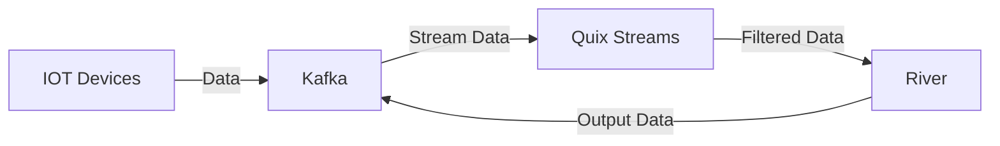

# 🦫 Beaver

<p align="center">
  
</p>

## Table of Contents

- [:memo: Description](#memo-description)
- [Prerequisites](#prerequisites)
- [:wrench: Installation](#wrench-installation)
- [:ocean: Quickstart](#ocean-quickstart)
- [:memo: Detailed Explanation](#memo-detailed-explanation)
  - [Model](#model)
  - [Param](#param)
  - [data](#data)
  - [Assignments](#assignments)
  - [Connector](#connector)
  - [Pipeline](#pipeline)
- [Pipeline class](#pipeline-class)
- [:droplet: River support](#droplet-river-support)
- [:computer: Usage](#computer-usage)
  - [Wikimedia Project](#wikimedia-project)
  - [Electricity Project](#electricity-project)
  - [House Prices Project](#house-prices-project)
- [:wrench: Tools and Technologies](#wrench-tools-and-technologies)
- [:eyes: Visual Representation](#eyes-visual-representation)
- [:handshake: Affiliations](#handshake-affiliations)

## :memo: Description

Beaver is a DSL language designed for machine learning in live data. It is designed to make the process of retrieving, storing, filtering data as well as training models easy and accessible to everybody.

## Prerequisites

- Python 3.x
- Docker
- Apache Kafka
- Other dependencies as required

## :wrench: Installation

1. Clone the repository:

   ```bash
   git clone https://github.com/deepblue597/thesis.git
   cd thesis
   ```

2. Install the required Python packages:

   ```bash
   pip install -r requirements.txt
   ```

3. Set up Kafka infrastructure:
   ```bash
   cd kafka_proj
   docker compose up
   ```

## :ocean: Quickstart

To create your first pipeline we will start with a classification example which can be found in `classification.peng`

```yaml


pipeline linear_algorithm {

    output_topic : 'ALMAClassifierBVR'
    data : phising
    algorithm : alma
    metrics : [accuracy]
}


connector {

    connection_params {

        bootstrap_servers = "localhost:39092",
        security_protocol = "plaintext"


    }

    kafka_params {

        consumer_group = 'test_consoumers'

    }

}

data phising {

    input_topic : 'Phishing'
    features {
        target_feature : class
    }
    preprocessors : [[standardScaler]]
}


preprocessors {

        model standardScaler {

            type : preprocessing
            name : StandardScaler

        }

}


algorithms {

    model alma {

            type : linear_model
            name : ALMAClassifier
        }


}


metrics {

    model accuracy {

            type : metrics
            name : Accuracy
        }

}

```

To run this code, save it as `<name>.bvr`, go to the beaver folder by typing:

```bash
cd beaver
```

and then type in your terminal:

```bash
python3 generator.py --metamodel <name>.bvr --generated_file_name <pipeline>.py
```

This will create your pipeline at `<pipeline>.py`. Then you can type:

```bash
python3 <pipeline>.py
```

and your model will be created.

## :memo: Detailed Explanation

### Model

The basic component of the language is the **Model**

The model has the following parameters

- name : ID of the model
- type : which model group it belongs to (e.g. linear_model )
- subtype : Optional parameter. Some models are within a model subtype group (e.g. `ddm = drift.binary.DDM()` ) so we will need this information to define
- NameR : the name of the model in the river. The name parameter is used to define the id of the model
- Params : The parameters of the model which can be 0 and above. That's why it is defined as an Optional parameter.

e.g.

```yaml
model preproc1 {

    type : standardScaler
    subtype : pre
    name : logreg
    params : {
        lr = 1,
        optim = optim1,
        param = 0.2,
        test = ["model" , "model2"],
        dict = { "true" : 1  , 'false' : 0},
        problem = false
    }
}
```

### Param

Are the parameters of the models

can be numbers, strings, dicts, lists and even references to models

We have 2 parameters

- name : the name of the variable
- value : the value of

To be able to cover all types of parameters we have created the ParamValue component. inside it there are Models for dicts & lists and references.

Note: In ParamValue there is the Reference component which has been created exclusively to be able to Reference other Models. I tried to omit the Reference Model and include it directly in ParamValue but it throws an error. I'll look into it more to see if I can fix it.

Example of the Params component is shown in the example above

The component Model uses 4 pieces of language that the user will write

- preprocessors
- algorithms
- optimizers
- metrics

Why I separated them like this

1. seperation of concerns : The user can define as many models processors optimizers algorithms algorithms etc as he wants. To be able to separate them better and to know where each model is defined I put them in separate components. This will also help in the final stage of defining the pipelines
2. It is similar to the components that make up a data pipeline. we have models for preprocessing for the algorithms, optimizers and metrics.

### Data

Contains all the information for defining and processing the data

parameters

- name → id of the component
- input topic → where to get the data from
- features → the data elements divided into
  - drop_features → the ones we won't need so we filter them out
  - generated_featrures → elements generated from already existing elements. these are Assigment components which I summarize below.
  - keep features → if we want to define the elements we want to keep.
  - target feature → the y
- preprocessors → ID of the preprocessors we want to use in the data. **Caution**! here we do not define the preprocessors but only their ID for reference.

Example:

```yaml
data testData {

    input_topic : 'test_input_topic'

    features {
        drop_features : [ drop1 , drop2 ]
        generated_features : {
            generated1 = keep1 - 2 * keep2;
            generated2 = keep * keep;
        }
        target_feature : class
    }

    preprocessors : [[preproc1 , preproc2 ]]
}

```

### Assignments

The component is used for defining functions for features; consists of other components that define variables, operations and the hierarchy in which the translator must translate them.

Example assignment definition is shown in the above example in the generated features.

### Connector

connector is the component that connects the database to our application

It is divided into 2 parts

- connection_params → the parameters for the connection (broker , connection_type , username , password etc )
- kafka_params → the parameters of kafka ( e.g consumer_group )

example

```yaml
connector {

connection_params {

bootstrap_servers = "localhost:39092",
security_protocol = "sasl_plaintext",
sasl_username = "username",
sasl_password = "admin_pass"

}

kafka_params {

consumer_group = 'the_test_consumer_group'

}

}
```

### Pipeline

It is the overall pipeline that will be used to retrieve and process the data, learn the algorithm and the metrics to be used.

It consists of the following parameters

- name → id of the component
- output_topic → optional for where the data will be sent
- data → reference to the data component we have defined
- algorithm → reference to the algorithm component we have defined
- metrics → reference to 1 or more metric components that we have defined

example

```yaml
pipeline testPipeline1 {

    output_topic : 'tester_topic'
    data : testData
    algorithm : testAlgo
    metrics : [testMetric1 , testMetric2]
}
```

### File

The definition of components in the .bvr file follows the following order

```yaml
File :

    pipeline += Pipeline
    connector = Connector
    data += Data
    preprocessors *= Preprocessors
    algorithms = Algorithms
    optimizers *= Optimizers
    metrics = Metrics

;
```

Complete example of a `.bvr` file

```yaml


pipeline testPipeline {

    output_topic : 'tester_topic'
    data : testData
    algorithm : testAlgo
    metrics : [testMetric1 , testMetric2]
}

pipeline testPipeline1 {

    output_topic : 'tester_topic'
    data : testData
    algorithm : testAlgo
    metrics : [testMetric1 , testMetric2]
}

connector {

    connection_params {

        broker = "localhost:39092",
        connection_type = "sasl_plaintext",
        username = "username",
        password = "admin_pass"

    }

    kafka_params {

        consumer_group = 'the_test_consumer_group'

    }

}

data testData {

    input_topic : 'test_input_topic'
    features {
        drop_features : [ drop1 , drop2 ]
        generated_features : {
            generated1 = keep1 - 2 * keep2;
            generated2 = keep * keep;
        }
    }

    preprocessors : [ preproc1 , preproc2 ]
}

data testData2 {

    input_topic : 'test_input_topic'
    features {
        drop_features : [ drop1 , drop2 ]
        generated_features : {
            generated12 = keep1 - 2 * keep2;
            generated22 = keep * keep;
        }
    }

    preprocessors : [ preproc1 , preproc2 ]
}


preprocessors {

        model preproc1 {

            type : preprocessing
            name : AdaptiveStandardScaler
            params : {
                lr = 1,
                optim = optim1,
                param = 0.2,
                test = ["model" , "model2"],
                dict = { "true" : 1  , 'false' : 0},
                problem = false,
                string = "stringgg"
            }
        }

        model preproc2 {

            type : preprocessing
            name : FeatureHasher
            params : {
                n_features=10,
                seed=42
            }
        }
}


algorithms {

    model testAlgo {

            type : drift
            subtype : binary
            name : DDM
        }

    model testAlgo1 {

            type : linear_model
            name : ALMAClassifier
        }


}


optimizers {

    model optim1 {

            type : optim
            name : AdaDelta
        }


}


metrics {

    model testMetric1 {

            type : metrics
            name : AdjustedRand
        }

    model testMetric2 {

            type : metrics
            name : CohenKappa

        }


}

```

## Pipeline class

During the development of the pipeline it became obvious that we will need a pipeline class which will contain all the metrics, the output topic, the y and our model.

so the `Pipeline` class was created

### **\_\_init\_\_**()

In the init function we have the definition of the class parameters and the separation of the metrics.

Why do we separate the metrics ?

When the user adds metrics to the pipeline it does not separate them based on an attribute. In river 'but not all metrics can be put into a Wrapper class as they are not all compatible with each other. To make it easier for the user (and for extensibility reasons) we separate the metrics within the pipeline class. They are stored in a dict and separated into 4 keys

- Probabilistic → handle the predict_proba_one function; here we also do a check if the model supports this function. If not it will throw an error saying that the model does not support this metric
- Classification
- Regression
- Clustering

if it is not in one of these families it will throw an error (in case some metric types are overlooked we can add them later)

### train_and_predict(X)

The function that will be called when the pipeline is run. It will do the following

- the training of the algorithm
- the predictions of the algorithm
- updating the metrics
- returning the dict we want to send to the output topic (if there is one)

We first check if the model is supervised. If so, we should take the y out of the json file that comes to us from kafka and use it in learn_one. if not, we take the X as it is and put it in the learn_one. Then we update the metrics. If the metric is in the 'probabilistic' group, it will use y_predicted_proba otherwise it will use y_predicted. Then we update with the new prices the self.metrics_values which will be used to make the plots of the metrics. Then we update the model that we store in a `.pkl` file and return a dict with the predictions ( y_predicted , y_predicted_proba), y, and the new values of the metrics.

### metrics_plot()

The function is called to plot the metrics of each pipeline

## :droplet: River support

A table of the supported functionalities the DSL has for River

| Feature            | Supported? |
| ------------------ | ---------- |
| active             | ⬜         |
| anomaly            | ⬜         |
| bandit             | ⬜         |
| base               | ⬜         |
| cluster            | ⬜         |
| compat             | ⬜         |
| compose            | ⬜         |
| conf               | ⬜         |
| covariance         | ⬜         |
| datasets           | ⬜         |
| drift              | ⬜         |
| dummy              | ⬜         |
| ensemble           | ⬜         |
| evaluate           | ⬜         |
| facto              | ⬜         |
| feature_extraction | ⬜         |
| feature_selection  | ⬜         |
| forest             | ✅         |
| imblearn           | ⬜         |
| linear_model       | ✅         |
| metrics            | ⬜         |
| misc               | ⬜         |
| model_selection    | ⬜         |
| multiclass         | ⬜         |
| multioutput        | ⬜         |
| naive_bayes        | ⬜         |
| neighbors          | ⬜         |
| neural_net         | ⬜         |
| optim              | ⬜         |
| preprocessing      | ⬜         |
| proba              | ⬜         |
| reco               | ⬜         |
| rules              | ⬜         |
| sketch             | ⬜         |
| stats              | ⬜         |
| stream             | ⬜         |
| time_series        | ⬜         |
| tree               | ⬜         |
| utils              | ⬜         |

✅ : Full support \
🚧: Partial support \
⬜ : Not supported yet \
❌ : Will not get support

## :computer: Usage

The `examples` folder contains several projects that demonstrate how to use the Penguin DSL for different machine learning tasks. Below is a brief description of each project:

### Wikimedia Project

The Wikimedia project demonstrates how to use the Penguin DSL to create a machine learning pipeline for classifying Wikipedia events. The project includes the following files:

- `HoeffdingTreeClassifier.pkl`: A pre-trained model file.
- `model.py`: Script for defining and training the model.
- `prediction.py`: Script for making predictions using the trained model.
- `producer.py`: Script for producing data to Kafka topics.

### Electricity Project

The Electricity project showcases how to use the Penguin DSL for predicting electricity consumption. The project includes the following files:

- `combined_file_hourly.csv`: Combined hourly electricity consumption data.
- `combined_file.csv`: Combined electricity consumption data.
- `consumer.py`: Script for consuming data from Kafka topics.
- `data_test.py`: Script for testing data processing.
- `FR_2024_hourly.csv`: Hourly electricity consumption data for France.
- `live_producer.py`: Script for live data production.
- `playground.py`: Script for experimenting with data and models.
- `prediction.py`: Script for making predictions using the trained model.
- `producer.py`: Script for producing data to Kafka topics.
- `SNARIMAX_electricity_h.pkl`: A pre-trained model file for electricity consumption prediction.

### House Prices Project

The House Prices project demonstrates how to use the Penguin DSL for predicting house prices. The project includes the following file:

- `house-prices.py`: Script for defining, training, and evaluating the house prices prediction model using the Penguin DSL.

## 🛠 Tools and Technologies

- Apache Kafka
- Quix streams
- River
- Docker
- Text-X
- Jinja

## :eyes: Visual Representation

A visual representation of the process that will be built is displayed below:



## 🤝 Affiliations


