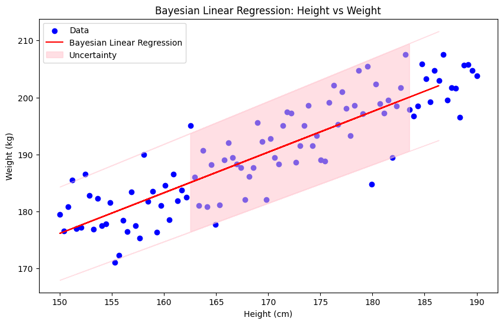

# ALMA

ALMA classifier is a type of machine learning algorithm used for classification tasks. ALMA stands for "Adaptive Linear Machine for Adaptive Classification." It is particularly known for its simplicity and efficiency in handling large-scale datasets.

## Key Features of ALMA Classifier:

1. Linear Classifier: ALMA is a linear classifier, meaning it makes decisions based on a linear combination of input features. This makes it computationally efficient and easy to implement.

2. Adaptive Learning: The algorithm adapts its parameters over time based on the data it encounters. This adaptive nature allows it to improve its performance as it processes more data.

3. Mistake-Driven: ALMA updates its model only when it makes a mistake. This makes it efficient in terms of computational resources, as it does not need to update the model on every data point.

4. Margin-Based: ALMA aims to maximize the margin between different classes, similar to Support Vector Machines (SVMs). This helps in improving the generalization performance of the classifier.

5. Online Learning: ALMA can be used in an online learning setting, where data arrives sequentially, and the model is updated incrementally. This is useful for applications where data is continuously generated.

## How ALMA Works:

- Initialization: Start with an initial set of weights.
  Prediction: For each incoming data point, compute the predicted class using the current weights.

- Update: If the prediction is incorrect, update the weights to reduce the likelihood of making the same mistake in the future.

- Repeat: Continue this process for each data point in the dataset.

## Applications:

- Text Classification: ALMA can be used for classifying text documents into different categories.

- Spam Detection: It can be employed to distinguish between spam and non-spam emails.

- Image Recognition: ALMA can be used for simple image classification tasks.

## Advantages:

- Efficiency: Due to its linear nature and mistake-driven updates, ALMA is computationally efficient.

- Scalability: It can handle large datasets and is suitable for online learning scenarios.
- Simplicity: The algorithm is straightforward to implement and understand.

## Limitations:

- Linear Boundaries: As a linear classifier, ALMA may struggle with datasets that have complex, non-linear decision boundaries.

- Feature Engineering: The performance of ALMA can be heavily dependent on the quality of the input features.

## Explanation of Parameters:

- alpha: This parameter controls the learning rate of the algorithm. It determines how much the model's weights are adjusted in response to a mistake. A higher alpha means more significant updates, while a lower alpha means smaller updates.

- B: This parameter is related to the margin that the algorithm aims to maintain between different classes. It helps in ensuring that the classifier not only makes correct predictions but also does so with a certain level of confidence.

- C: This parameter is a regularization term that helps in preventing overfitting. It balances the trade-off between achieving a large margin and minimizing the classification error.

### Explanation of p

- L1 Regularization (p = 1): This type of regularization adds a penalty equal to the absolute value of the magnitude of coefficients. It can lead to sparse models, where some of the weights are exactly zero. This is useful for feature selection, as it effectively removes some features from the model.

- L2 Regularization (p = 2): This type of regularization adds a penalty equal to the square of the magnitude of coefficients. It tends to distribute the weight values more evenly, leading to models where all features contribute to the prediction. This is often used to prevent overfitting by keeping the weights small.

# Bayesian Linear Regression

is a probabilistic approach to linear regression that incorporates Bayesian inference to estimate the distribution of the model parameters, rather than just point estimates. This approach provides a framework for quantifying uncertainty in the model predictions, which can be particularly useful in scenarios where data is limited or noisy.
An advantage of Bayesian linear regression over standard linear regression is that features do not have to scaled beforehand. Another attractive property is that this flavor of linear regression is somewhat insensitive to its hyperparameters. Finally, this model can output instead a predictive distribution rather than just a point estimate.

### Key Concepts:

1. **Prior Distribution**: In Bayesian Linear Regression, we start with a prior distribution over the model parameters (weights). This prior encapsulates our initial beliefs about the parameters before observing any data.

2. **Likelihood Function**: The likelihood function describes the probability of observing the data given the model parameters. For linear regression, this is typically modeled using a Gaussian distribution.

3. **Posterior Distribution**: The posterior distribution is obtained by combining the prior distribution with the likelihood of the observed data using Bayes' theorem. This distribution represents our updated beliefs about the model parameters after observing the data.

4. **Predictive Distribution**: The predictive distribution is used to make predictions for new data points. It takes into account the uncertainty in the model parameters by integrating over the posterior distribution.

### Advantages:

- **Uncertainty Quantification**: Bayesian Linear Regression provides a measure of uncertainty in the predictions, which can be crucial for decision-making under uncertainty.
- **Regularization**: The prior distribution can act as a form of regularization, preventing overfitting, especially when dealing with small datasets.
- **Incorporating Prior Knowledge**: Allows for the incorporation of prior knowledge or beliefs about the model parameters, which can improve the model's performance.

### Limitations:

- **Computational Complexity**: Bayesian methods can be computationally intensive, especially for large datasets or complex models.
- **Choice of Prior**: The performance of the model can be sensitive to the choice of the prior distribution.

### Applications:

- **Risk Assessment**: Useful in fields like finance and healthcare, where quantifying uncertainty is important.
- **Small Datasets**: Particularly useful when dealing with small datasets, as the prior can provide additional information.
- **Model Comparison**: Bayesian methods allow for comparing different models based on their posterior probabilities.

### Simplified Explanation:

1. **Start with Beliefs**: Before looking at any data, you have some initial beliefs (prior) about how the data might behave. For example, you might believe that the relationship between height and weight is roughly linear.

2. **Collect Data**: You gather data to see how height and weight are actually related.

3. **Update Beliefs**: Using the data, you update your initial beliefs to form new beliefs (posterior) about the relationship. This update is done using Bayes' theorem, which combines your prior beliefs with the likelihood of the data.

4. **Make Predictions**: With your updated beliefs, you can make predictions about new data points and also quantify the uncertainty in those predictions.

### Example:

Imagine you're trying to predict a person's weight based on their height.

1. **Prior Beliefs**:

   - You start with a guess (prior) that the average weight is 70 kg, and for every additional cm in height, the weight increases by 0.6 kg.
   - You also believe there's some uncertainty in these estimates.

2. **Collect Data**:

   - You measure the heights and weights of 100 people.

3. **Update Beliefs**:

   - Using the collected data, you update your guess. You find that the average weight is actually 72 kg, and the weight increases by 0.7 kg for each additional cm in height.
   - You also update your uncertainty: you're more confident about the average weight but still a bit uncertain about the rate of increase.

4. **Make Predictions**:
   - For a new person who is 170 cm tall, you predict their weight to be around 72 kg + 0.7 kg \* (170 cm - average height).
   - You also provide a range (e.g., 68 kg to 76 kg) to reflect your uncertainty.

### Visualization:

Let's visualize this process with a simple example using synthetic data.

### Simplified Explanation with Example:

**Bayesian Linear Regression** is a way to predict a numerical outcome (like weight) based on one or more input features (like height) while also considering uncertainty in the predictions.

#### Example: Predicting Weight from Height

1. **Data**: We have data on people's heights and weights. We want to predict a person's weight based on their height.

2. **Model**: We use a linear model, which assumes that weight can be predicted using a straight line equation: \( \text{weight} = a \times \text{height} + b \).

3. **Uncertainty**: Unlike regular linear regression, Bayesian Linear Regression doesn't just give a single prediction. It provides a range of possible weights, reflecting the uncertainty in the prediction.

4. **Prior Beliefs**: Before looking at the data, we have some initial beliefs (priors) about the parameters \( a \) and \( b \). These could be based on previous studies or general knowledge.

5. **Updating Beliefs**: We update these beliefs using the actual data (heights and weights) to get a posterior distribution, which tells us the likely values of \( a \) and \( b \).

6. **Prediction with Uncertainty**: When predicting the weight for a new height, we get a range of possible weights. This range (uncertainty) is wider where the model is less confident and narrower where it is more confident.

In the plot:

- The blue dots are the actual data points.
- The red line is the predicted weight based on height.
- The pink shaded area shows the uncertainty in the predictions. The width of this area indicates how confident the model is in its predictions.

This approach is useful when you want to understand not just the predicted value but also how reliable that prediction is.
